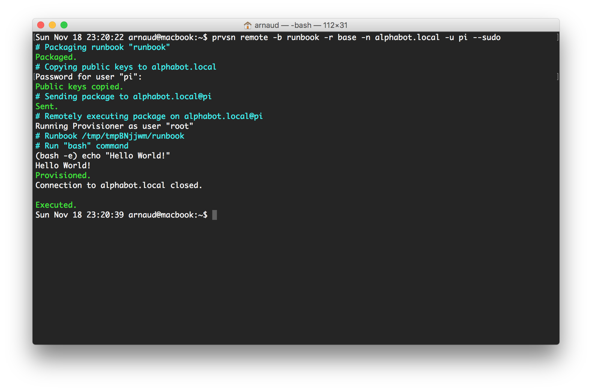

prvsn
=====

`prvsn` (provision) is a simple provisioning tool that works on Python 2.7 and 3. It has no external dependencies besides Python.

## Motivation

Easy and lightweight machine configuration.

### Goals

- Configure a single machine easily:
    - add a file
    - install package
    - run command
- Works out of the box:
    - Python 2.7 & 3 compatibility
    - no external dependencies

### Non-Goals

- Large scale provisioning
    - support for thousands machines
- Strict dependencies and dependency graph
- External modules / store support

If those are your goals, have a look at alternatives like Puppet, Chef or Ansible.

## Installation

### Install

Note 27/11/2018: this tool is under active development; prefer github for latest improvements and bug fixes!

From PyPi:

    pip install prvsn
   
From Github:

    git clone git@github.com:acoomans/prvsn.git
    cd prvsn
	python setup.py install

Or for development:

	python setup.py develop

## Usage

See [Manual](documentation/MANUAL.md).